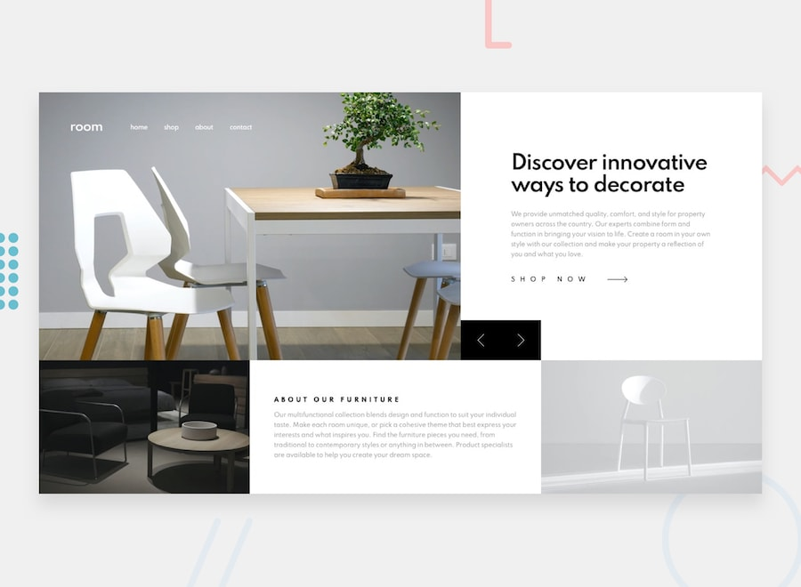

# Room homepage

## The challenge

This was a challenge is to build out e-commerce homepage and get it looking as close to the design as possible.

Users can be able to:

- View the optimal layout for the site depending on their device's screen size
- See hover states for all interactive elements on the page
- Navigate the slider using either their mouse/trackpad or keyboard

